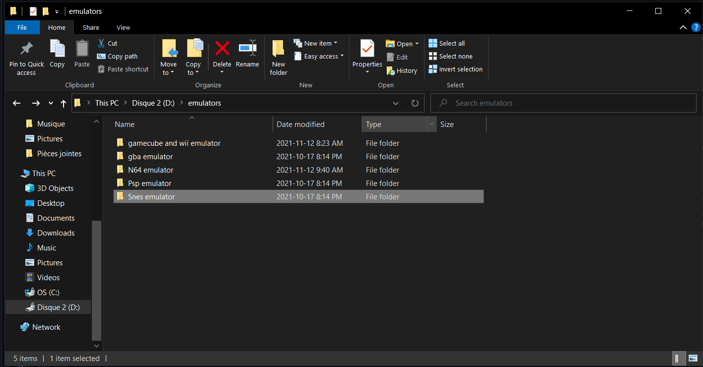

# Les émulateurs de consoles

## __*AVERTISSEMENT*__: 
Malgré la légalité des programmes d'émulations en eux-même, les roms utilisés dessus sont illégales, je ne donnerais donc aucun site pour rechercher des roms dans ce tutoriel.

## Introduction

L'émulation est un sujet intéressant, un programme permettant de créer un système à l'intérieur du système d'un ordinateur. Ils permettent également de faire quelque chose qui devrait être pris plus au sérieux par les grandes compagnies, c'est-à-dire la préservation des anciens jeux. Quelque chose qui est pris très au sérieux dans des domaines tel que le film et la musique, mais souvent très peu pratiqué dans le domaine du jeu vidéo. Les jeux vidéos sont également des oeuvres d'art et méritent qu'on leur apporte autant d'attention, si ce n'est plus car même si nous pouvons faire jouer un film sur n'importe quel lecteur, un jeu ne fonctionne que sur le système pour lequel is a été conçu.

## En fait, c'est quoi un émulateur?

On peut comparer un émulateur à un parasite, car il force le système d'un ordinateur à exécuter un second système (c'est à dire le système de la console) en parralèle au système que l'ordinateur exécute déja, c'est à dire windows, macOS ou bien linux. C'est pourquoi certains ordinateurs moins puissants peuvent avoir des problèmes. Un émulateur correspond à la description d'un parasite car il prend des ressources de l'ordinateur sans rien donner en retour, il ne peut également pas exister par lui même.

>Comme vous pouvez voir ici, exécuter un jeu wii de 14 ans prend 10% de mon cpu

## Le tutoriel

Ce tutoriel va surtout se porter sur comment utiliser plusieurs émulateurs, je ferais une liste à la fin, mais je vais surtout parler de ceux avec lesquels j'ai de l'expérience. Mais avant cela, quelques conseils à ceux et celles qui voudrait éventuellement se plonger dans ce monde:

### C'est quoi une rom?

Une rom, ou bien un fichier .rom, est l'image d'une cartouche, c'est l'entièreté du contenu d'une cartouche contenu dans un fichier, c'est la même chose pour les fichiers .iso qui sont l'image d'un disque compact. Quand vous recherchez une rom, n'installez jamais de fichier .exe, les roms ne sont pas des exécutables, car sinon les émulateurs ne serviraient pas à grand chose, ces fichiers sont toujours des virus. Le seul autre fichier dans lequel une rom peut apparaître serait un fichier .zip, mais à ce moment là, **Toujours analyser les fichiers .zip avant de les extraire.** À cause de la nature du sujet, il y a souvent des virus dans les roms, il faut faire extrêmement attention lorsqu'on recherche ces fichiers.

### Comment organiser ses fichiers.

Toujours avoir un fichier mère avec tout les émulateurs à l'intérieur, par exemple, voici le mien:

>Chacun de ces dossiers contiennent l'émulateur en question ainsi que les roms ou isos

Toujours avoir les roms au même endroit que l'émulateur facilite les choses car certains émulateurs vont demander un fichier dans lequel aller chercher les jeux, avoir le fichier à côté facilite les choses. Cela permet aussi de ne pas avoir à rechercher chaque roms une par une lorsque on essai d'ouvrir un jeu avec un émulateur un peu plus vieux.

### À quel moment est ce que utiliser un émulateur devient quelque chose d'acceptable?

Les émulateurs de systèmes encore en ventes sont morallement incorrects, car ce n'est plus de la préservation, mais du piratage pur et simple, dans le monde de l'émulation, les limites sont marquées par les morales de l'utilisateur. Dans mon cas, je n'accepte d'utiliser un emulateur seulement dans les cas ou le jeu n'est plus officielement en vente et la seule manière de l'obtenir et de l'acheter à un prix ridicule a un vendeur tiers.

