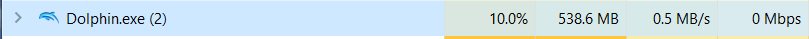
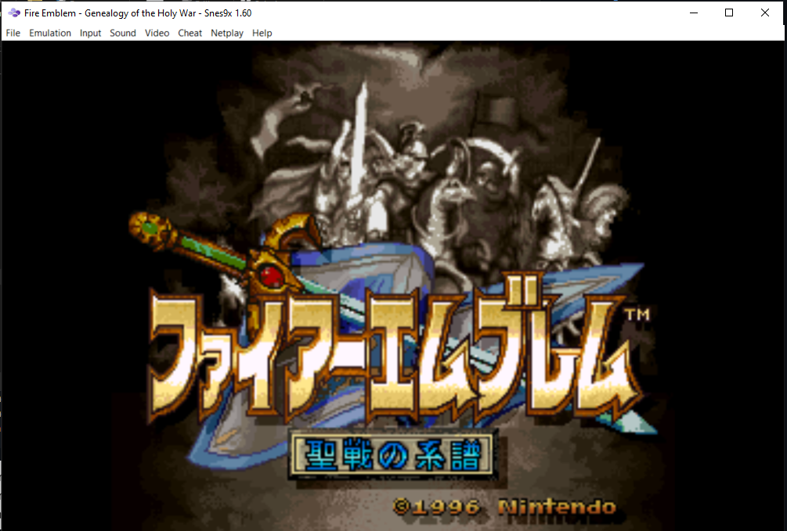

# Les émulateurs de consoles

## __*AVERTISSEMENT*__: 
Malgré la légalité des programmes d'émulations en eux-même, les roms utilisés dessus sont illégales, je ne donnerais donc aucun site pour rechercher des roms dans ce tutoriel.

## Introduction

L'émulation est un sujet intéressant, un programme permettant de créer un système à l'intérieur du système d'un ordinateur. Ils permettent également de faire quelque chose qui devrait être pris plus au sérieux par les grandes compagnies, c'est-à-dire la préservation des anciens jeux. Quelque chose qui est pris très au sérieux dans des domaines tel que le film et la musique, mais souvent très peu pratiqué dans le domaine du jeu vidéo. Les jeux vidéos sont également des oeuvres d'art et méritent qu'on leur apporte autant d'attention, si ce n'est plus car même si nous pouvons faire jouer un film sur n'importe quel lecteur, un jeu ne fonctionne que sur le système pour lequel is a été conçu.

## En fait, c'est quoi un émulateur?

On peut comparer un émulateur à un parasite, car il force le système d'un ordinateur à exécuter un second système (c'est à dire le système de la console) en parralèle au système que l'ordinateur exécute déja, c'est à dire windows, macOS ou bien linux. C'est pourquoi certains ordinateurs moins puissants peuvent avoir des problèmes. Un émulateur correspond à la description d'un parasite car il prend des ressources de l'ordinateur sans rien donner en retour, il ne peut également pas exister par lui même.

>Comme vous pouvez voir ici, exécuter un jeu wii de 14 ans prend 10% de mon cpu

## Le tutoriel

Ce tutoriel va surtout se porter sur comment utiliser plusieurs émulateurs, je ferais une liste à la fin, mais je vais surtout parler de ceux avec lesquels j'ai de l'expérience. Mais avant cela, quelques conseils à ceux et celles qui voudrait éventuellement se plonger dans ce monde:

### C'est quoi une rom?

Une rom, ou bien un fichier .rom, est l'image d'une cartouche, c'est l'entièreté du contenu d'une cartouche contenu dans un fichier, c'est la même chose pour les fichiers .iso qui sont l'image d'un disque compact. Quand vous recherchez une rom, n'installez jamais de fichier .exe, les roms ne sont pas des exécutables, car sinon les émulateurs ne serviraient pas à grand chose, ces fichiers sont toujours des virus. Le seul autre fichier dans lequel une rom peut apparaître serait un fichier .zip, mais à ce moment là, **Toujours analyser les fichiers .zip avant de les extraire.** À cause de la nature du sujet, il y a souvent des virus dans les roms, il faut faire extrêmement attention lorsqu'on recherche ces fichiers.

### Quels avantages y-a-t'il à utiliser un émulateur?

En plus d'être plus facile à obtenir que des copies de jeux vieux de 20 ans, les émulateurs apportent plusieurs fonctions que les jeux originals n'avaient pas, par exemple, la possibilité de changer le mapping des controls, ou bien encore, une fonction assez connue des émulateurs, la save state, qui permet à l'utilisateur de sauvegarder à n'importe quel moment, ce qui peux bien sûr être abusé, mais faites attention lorsque vous utilisez cette fonction, car vour pourriez rester bloqué dans une boucle. Si la situation dans laquelle vous avez fait une save state est impossible à éviter. Ce genre de fonction sont d'ailleurs très utiles en speedrun pour pratiquer un segment en particulier.

### Comment organiser ses fichiers?

Toujours avoir un fichier mère avec tout les émulateurs à l'intérieur, par exemple, voici le mien:

>Chacun de ces dossiers contiennent l'émulateur en question ainsi que les roms ou isos

Toujours avoir les roms au même endroit que l'émulateur facilite les choses car certains émulateurs vont demander un fichier dans lequel aller chercher les jeux, avoir le fichier à côté facilite les choses. Cela permet aussi de ne pas avoir à rechercher chaque roms une par une lorsque on essai d'ouvrir un jeu avec un émulateur un peu plus vieux.

### À quel moment est ce que utiliser un émulateur devient quelque chose d'acceptable?

Les émulateurs de systèmes encore en ventes sont morallement incorrects, car ce n'est plus de la préservation, mais du piratage pur et simple, dans le monde de l'émulation, les limites sont marquées par les morales de l'utilisateur. Dans mon cas, je n'accepte d'utiliser un emulateur seulement dans les cas ou le jeu n'est plus officielement en vente et la seule manière de l'obtenir et de l'acheter à un prix ridicule a un vendeur tiers.

>_Fire emblem: Path of Radiance_, un des jeux publiés par Nintendo les plus rare sur la GameCube.

## Conseils émulateur par émulateur

Dans ce tutoriel, je vais majoritairement parler seulement des émulateurs avec lesquels j'ai de l'expérience. C'est à dire:

- Snes9x (Super Nintendo)
- VisualBoyAdvance (GameBoy advance)
- Project64 (Nintendo64)
- PPSSPP (PsP)
- Dolphin (GameCube/Wii)

Bien sûr, une manette est recommancée pour chacun d'entre eux, mais je vais quand même donner mes control mappings pour chaque émulateur.

### Snes9x

L'émulateur avec lequel j'ai le moins d'expérience sur la liste, quelque chose d'évident avec les émulateurs, c'est que plus le système est ancien ou bien simpliste, plus l'émulateur foncitonne bien, comme dans ce cas nous parlons d'un émulateur de Super Nintendo, cet émulateur est très stable

>_Fire emblem: Genealogy of the Holy war_, jeu originalement exclusif au Japon, traduit par un fan

Un conseil que je peux donner pour cet émulateur serait d'y jouer en petite fenêtre, comme tout ce que l'émulateur fait, c'est exécuter le jeu, il ne rempli pas les pixels étendus par le plein écran, ce qui donne des jeux très durs pour les yeux.

Pour information, voici mon control mapping sur Super Nintendo:

>l'idée était de plus ou moins répliquer le mapping original des controls sur la manette, mais sur un clavier. Certaines touches sont manquantes car elles ne sont pas nécéssaires.

Bref, c'est un très bon émulateur, et comme vous avez pu constater, il peux également utiliser des roms modifiées par des personnes, que ce sois pour des mods, ou bien comme dans cet exemple, un patch de langue. La Super Nintendo à été une des consoles les plus importantes de l'histoire, après le krash des jeux vidéos entraîné par atari, Nintendo avait vendu la NES originale comme un jouet, mais la super nintendo à été vendue comme une console de jeu, et elle fut très bien reçue car elle faisait tout ce que la NES faisait, mais mieux.

### VisualBoyAdvance

L'émulateur que j'ai le plus souvent utilisé dans les temps récents, et aussi celui sur lequel j'ai le plus de roms. Cet émulateur est aussi stable que celui pour la snes, en raison de la simpliciée du système. Comme ces émulateurs marchent parfaitement, c'est compliqué de dire beaucoup sur eux, mais bien sûr cela va changer avec ceux plus récents. 

>_Pokémon emerauld_, vu comme l'un des meilleurs jeux de la franchise.

Comme pour la Super Nintendo, Voici mes control mappings pour la GameBoy Advance:

>Ici, comme j'avais plus d'expérience avec l'émulateur, le mapping n'est pas une réplique des controls originaux, mais plutôt une version qui est plus agréable et faite pour ordinateurs.

Ici comme pour la snes, jouer en fenêtré est recommandé pour une meilleure expérience, prenez le de quelqu'un qui a joué a 2 jeux complets sur cet émulateur en plein écran, ce n'était pas agréable.

En résumé, la GameBoy Advance à été une des consoles portables avec une des bibilothèques de jeux les plus grandes, car en plus d'avoir en elle même une très grande collection, elle était également rétrocompatible avec la gameboy et la gameboy color. De plus, le pixel art des jeux est extrêmement plaisant à regarder. L'émulateur peux également supporter les mods et les patchs comme celui de Super Nintendo, la raison poour cela est qu'un émulateur ne se demande pas si c'est un jeu légitime comme la console originale, il ne fait que ce qui lui est demandé.

### Project64

À partir de maintenant, nous entrons dans les émulateurs de jeux en 3D, si c'était compliqué de jouer au jeux 2D des autres émulateurs, cela peux devenir une corvée sur ceux-ci mais il y a aussi quelque chose d'autre qui fait son arrivée avec cet émulateur, le repository, on peux donner un fichier à l'émulateur dans lequel aller chercher les roms et celles-ci vont s'afficher automatiquement sur l'émulateur lui-même.

>Ici, on peut voir ma liste de rom de n64 complète à l'intérieur de l'émulateur.

J'ai souvent utilisé cet émulateur dans le passé, même que c'était le premier que j'ai utilisé, c'est celui-ci qui m'a donné l'intérêt dans ce domaine. L'émulateur en lui même est encore en train recevoir des mises-à-jour, par exemple, la dernière fois que j'avais ouvert l'émulateur, il n'y avait pas encore de repository. La raison de pourquoi un émulateur aussi vieux recevrait encore des mises-à-jours est simple, un émulateur dois faire croire au jeu qu'il est en train de marcher sur la console. Puis certains jeux sont plus compliqués à manipuler que d'autres, certains comprènenet qu'ils ne sont pas sur la console et ne fonctionnent pas. Il peux y avoir plusieurs raisons pour cela.

>_Banjo-Kazooie_, ce jeu n'est pas l'un des plus connus de la console, mais il reste l'un des premiers collectathon et finira par inspirer des jeux tels que _Yooka-Laylee_, un successeur spirituel, et _A Hat in Time_, un des seuls bon platformers à être sorti dans les années récentes.

Bien sûr, voici mon control mapping, mais à partir de cet émulateur, je recommande sérieusement de jouer avec une manette, car ces jeux ne sont simplements pas faits pour être joués avec un clavier.

La Nintendo 64 à été une des premières consoles de jeu avec des jeux en 3 dimensions, malheureusement, le système était limité par l'utilisation de cartouches, alors que la Playstation utilisait des disques compactes, ce qui permettait d'avoir des jeux beaucoup plus grands et lourds, la Nintendo 64 est restée avec le support des cartouche. Cela ne change pas que cette console a dans sa librairie des jeux qui ont définis leurs genre, tels que _Super Mario 64_ ainsi que _The Legend of Zelda: Ocarina of Time_.

### PPSSPP

Le seul émulateur de la liste qui n'est pas d'une console Nintendo, Il est également très différent des autres émulateurs, ayant un interface unique à lui. 

